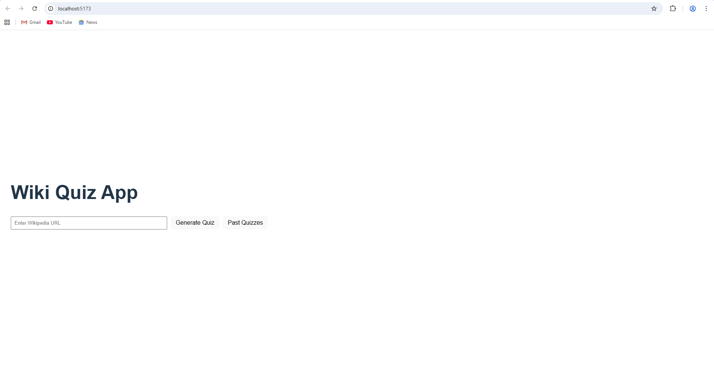
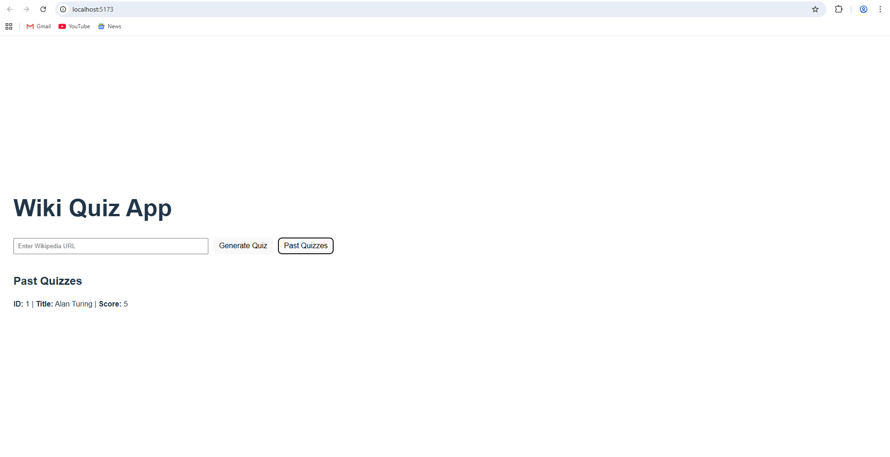

🚀 AI Wiki Quiz Generator

An AI-powered full-stack web application that automatically generates interactive quizzes from Wikipedia articles using an LLM.

📌 Project Overview

AI Wiki Quiz Generator allows users to:

🔍 Extract content from a Wikipedia URL

🤖 Generate AI-powered quizzes using an LLM (OpenRouter API)

📝 Create 5–10 multiple-choice questions

📊 Calculate and store quiz scores

📚 View past quiz history with saved scores

Each generated quiz includes:

✅ Question text

✅ Four options (A–D)

✅ Correct answer

✅ Short explanation

✅ Difficulty level (Easy / Medium / Hard)

✅ Related Wikipedia topics

🛠 Tech Stack
🔹 Backend

FastAPI

PostgreSQL

SQLAlchemy

OpenRouter API (LLM)

BeautifulSoup (Web Scraping)

🔹 Frontend

React (Vite)

Axios

CSS (Custom UI styling)

📂 Project Structure
wiki-quiz-app/
│
├── backend/
│   ├── services/
│   ├── prompts/
│   ├── sample_data/
│   ├── main.py
│   ├── models.py
│   ├── database.py
│   └── .env
│
├── frontend/
│
└── README.md

🧠 Architecture Flow

User enters a Wikipedia URL in the frontend.

Backend scrapes article content using BeautifulSoup.

Extracted content is sent to the LLM via OpenRouter API.

LLM generates a structured quiz in JSON format.

Quiz data is stored in PostgreSQL database.

User attempts the quiz and submits answers.

Score is calculated and updated in the database.

History endpoint retrieves past quizzes and scores.

⚙️ Installation & Setup
🔹 Backend Setup

1️⃣ Navigate to backend folder

cd backend

2️⃣ Create virtual environment

python -m venv venv

3️⃣ Activate virtual environment (Windows)

venv\Scripts\activate

4️⃣ Install dependencies

pip install -r requirements.txt

5️⃣ Run FastAPI server

python -m uvicorn main:app --reload

Backend runs at:

http://127.0.0.1:8000

Swagger Docs:

http://127.0.0.1:8000/docs

🔹 Frontend Setup

1️⃣ Navigate to frontend folder

cd frontend

2️⃣ Install dependencies

npm install

3️⃣ Run frontend

npm run dev

Frontend runs at:

http://localhost:5173

🔌 API Endpoints
📘 Generate Quiz
POST /generate-quiz?url=<wikipedia_url>

Example:

http://127.0.0.1:8000/generate-quiz?url=https://en.wikipedia.org/wiki/ISRO

📜 Get Quiz History
GET /history

📄 Get Quiz by ID
GET /quiz/{id}

📊 Update Quiz Score
PUT /quiz/{id}/score

Body:

{
  "score": 4
}

🤖 LLM Prompt Template Used
You are an expert quiz generator.

From the given Wikipedia content, generate a quiz with:

- 5–10 questions
- Each question must contain:
  - Question text
  - Four options (A–D)
  - Correct answer
  - Short explanation
  - Difficulty level (easy, medium, hard)

Also suggest 5 related Wikipedia topics for further reading.

Return the output strictly in valid JSON format.

🗄 Database

PostgreSQL is used to:

Store generated quizzes

Store user scores

Retrieve past quiz history

🧪 Sample URLs Tested

https://en.wikipedia.org/wiki/ISRO

https://en.wikipedia.org/wiki/Alan_Turing

https://en.wikipedia.org/wiki/Chandrayaan-3

Corresponding JSON outputs are available in:

backend/sample_data/

🎯 Features Implemented

✅ Dynamic quiz generation using LLM

✅ Explanation and difficulty per question

✅ Related topic suggestions

✅ Score calculation

✅ Score persistence in database

✅ Quiz history view

✅ Details modal view

✅ CORS enabled

✅ Responsive UI

✅ Clean and user-friendly interface

📸 Screenshots Included

### 🔹 Quiz Generation Page

[Quiz Page](screenshots/quizpage2.png)
[Quiz Page](screenshots/quizpage3.png)

### 🔹 History View

History View (Tab 2)

Details Modal View

👤 Author

Datla Satya Srinivasa Atchuta Ramaraju
B.Tech Computer Science Engineering
AI-based Quiz Generation Assignment